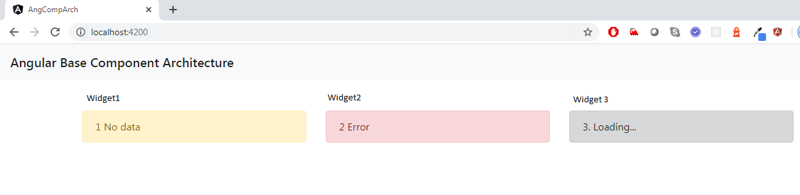
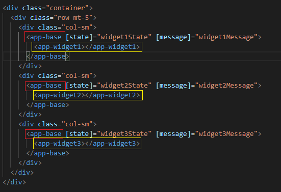
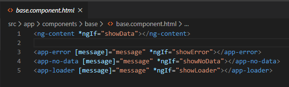

# Angular Base Component Architecture.

# Question

Consider a scenario where in you have to develop a UI dashboard application having many widgets on the page. And Each widget can show different data from the server, but at any point in time each widget will be in one of the four states and they are Data, No-Data, Loading and Error state. So, how to design this application?

# Answer

I would try designing the application with a base component. A base component will hold the loading, no-data and error state of the widget. So that we can reuse the base component as a wrapper to any kind of component and handle the states in better way.

To test this architecture pattern, please clone this repo and run the angular application. We can reuse this pattern for nay kind of component project. That is, we can use this idea in designing our React, Vue or Web component projects.

# Project Setup

This project was generated with [Angular CLI](https://github.com/angular/angular-cli) version 8.3.23.

1. Git clone `https://github.com/iamsaveku/angular-component-architecture.git`
2. Goto cloned location and open the command prompt.
3. `npm install`
4. `ng build`
5. `ng serve`
6. Navigate to `http://localhost:4200/`.

# You will see the below application.

As you can see that, we have three widgets on the screen with each in its own state and color.

And the code to handle the same in angular is as below.

As you can see below, we created error, loader and no-data as separeate component but using inside base component. Because of the `ng-content` directive we are able to show the content of widget 1, 2 and 3 inside the base component as shown above with yello border. The logic for showing different component states will be handled in base component.

By this, we can reuse the base component in multiple widgets of our application with a generic loader, no-data and error component to make it consistent across the application.

# Improvements
Instead of directly writing the error, no-data and loader directive on the base component we can dynamically inject the respective component from .ts file in angular. Hope you will take it as a challenge and implememt it.

# Licence
MIT

> ## The day you stop learing, you stop earning ~ @iamsaveku
> ## Happy Coding and Sharing :)
